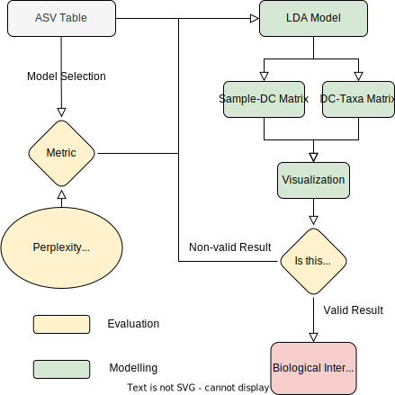

# Microbiome LDA Topic Modeling Workflow

## Overview
This workflow implements Latent Dirichlet Allocation (LDA) topic modeling for microbiome data analysis using MALLET through the my_little_warp Python interface.

## Workflow Illustration
Please refer to the workflow diagram in  for a visual representation of the process.

## Workflow Steps
The workflow consists of three steps, corresponding to three `.py` files. The first step may take significant time to run (depends on the size of your data, potentially hours). Once all models are calculated, you can select an optimal model based on evaluation metrics and domain interpretation.
Three types of data are required: an ASV table (rows represent samples, columns represent features), a taxonomy mapping file, and sample metadata. You can find examples of these data files in the example folder.
### Step 1: Model Building (`step1_loop_.py`)
- Inputs include ASV table and taxonomy mapping file.
- Explore topic models across a predefined range of topics (K)
- Default K range: 2 to 21 microbe components (MC), but adjust this range based on your research question
- Fewer models will take less time to run
- Utilize MALLET for robust LDA topic modeling
- Implement through my_little_warp Python interface

### Step 2: Model Evaluation (`step2_selection(new).py`)
- Calculate and analyze key evaluation metrics
- Metrics include:
  - Coherence scores
  - Perplexity
  - Number of microbe component clusters in all models (Ideally, K should not exceed this number)
- Compare performance across different numbers of topics

### Step 3: Model Selection and Visualization (`step3_visualization.py`)
- Inputs include which K you selected.
- Make an informed decision on the optimal number of topics
- Generate visualizations to support topic interpretation
- Create:
  - MC-sample heatmap, annotated by selected metadata
  - MC-ASV heatmap
  - Interpretative visualizations of microbiome topics

## Key Considerations
- Careful selection of K (number of topics)
- Interpretation of topics in the biological context
- Validation of results

## Output
Comprehensive analysis of microbiome data through probabilistic topic modeling

## Installation

# Clone the repository
git clone https://github.com/username/microbiome-lda-workflow.git
cd microbiome-lda-workflow

# Create and activate conda environment
conda env create -f environment.yml
conda activate microbiome-lda
